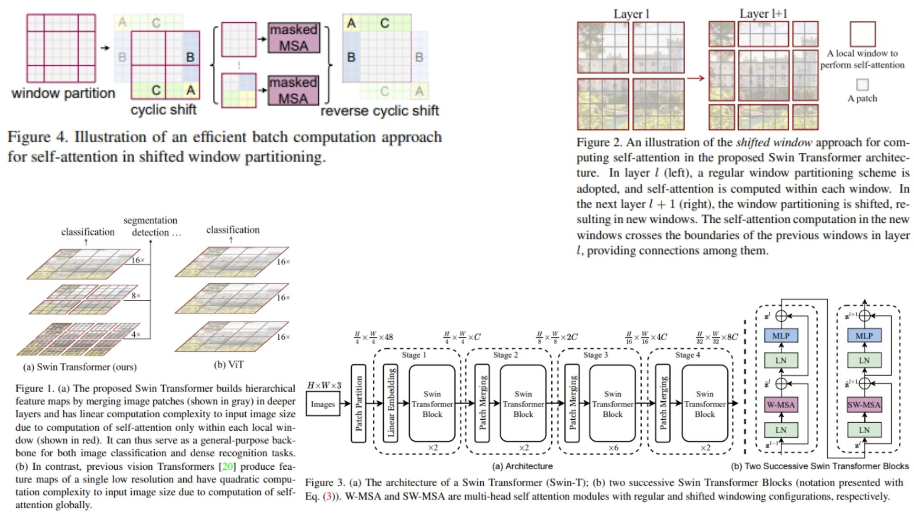

# 🌙 Swin Transformer – PyTorch Replication

This repository contains a **minimal and faithful replication** of the **Swin Transformer** architecture in PyTorch.  
The goal is to reproduce the core components of the model — **shifted windows**, **hierarchical feature extraction**, and **window-based self-attention** — in a clean, modular, and easy-to-extend form.  

- Window-based self-attention with **W-MSA** and **SW-MSA** 🌗  
- Fully hierarchical structure with **Patch Embedding** and **Patch Merging** 🪄  
- Modular design: each stage implemented in its own file ✨  
- Suitable as a backbone for detection, segmentation, or further research 🐚  

**Paper reference:** [Swin Transformer: Hierarchical Vision Transformer using Shifted Windows](https://arxiv.org/abs/2103.14030) 🌙


---

## 🌄 Overview – Swin Architecture



This overview highlights the hierarchical structure of Swin:

- The input image is split into **patch embeddings**.
- Transformer blocks operate using **window-based multi-head self-attention (W-MSA)**.
- Adjacent layers use **shifted windows (SW-MSA)** to connect local regions.
- Spatial size progressively decreases while channel dimension increases.
- Final features can be used for detection, segmentation, or other tasks.

---

## 📐 Key Mathematical Idea

At the heart of Swin lies **window-based attention**:

Given an input feature map  
$$X \in \mathbb{R}^{(H \times W) \times C}$$

Swin partitions it into windows of size  
$$M \times M$$  
and applies attention inside each window:

$$
\text{Attention}(Q,K,V) = \text{Softmax}\left(\frac{QK^\top}{\sqrt{d}} + B\right)V
$$

where:

- \(Q, K, V\) are projections of \(X\).
- \(B\) is the **relative position bias**.

In the next layer, windows are **shifted by $$(\frac{M}{2}\)$$**:

$$
\text{SW-MSA}(X) = \text{W-MSA}(\text{Roll}(X))
$$

This shift allows tokens from neighboring windows to interact, enabling Swin to build **long-range dependency** progressively but efficiently.

**Patch Merging Downsampling**

For each 2×2 region:

$$
Y = \text{Linear}(\text{Concat}(x_{00}, x_{01}, x_{10}, x_{11}))
$$

Spatial size → halves  
Channels → doubles

---

## 📦 File Structure

```bash
Swin-Replication/
│
├── src/
│   ├── layers/
│   │   ├── patch_embed.py
│   │   ├── window_attention.py
│   │   ├── mlp_block.py
│   │   ├── swin_block.py
│   │   └── patch_merging.py
│   │
│   ├── backbone/
│   │   └── backbone_swin.py
│   │
│   ├── model/
│   │   └── swin_model.py
│   │
│   └── config.py
│
├── images/
│   └── figmix.jpg
│
├── requirements.txt
└── README.md
```
---


## 🔗 Feedback

For questions or feedback, contact: [barkin.adiguzel@gmail.com](mailto:barkin.adiguzel@gmail.com)
